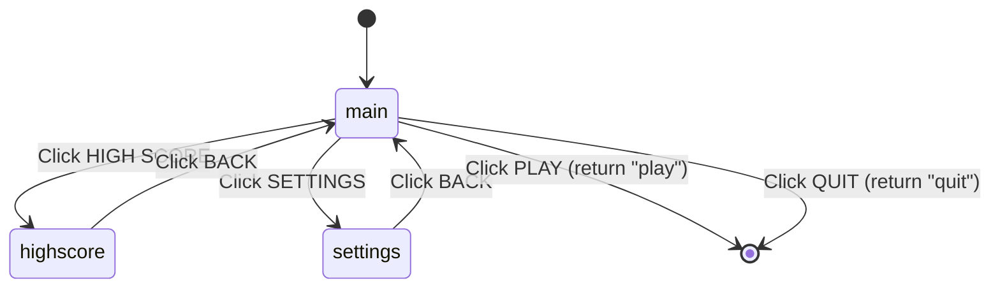
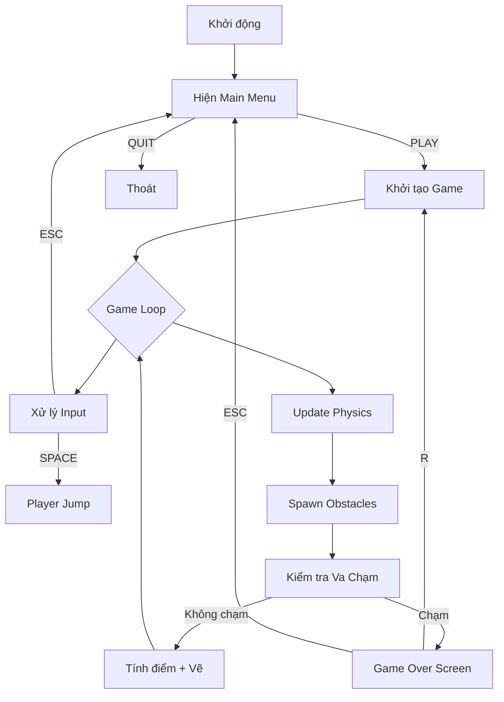

# 📖 MUSOU DASH — Giải Thích Toàn Bộ Logic Code

> Tài liệu chuẩn bị thi vấn đáp. Mỗi phần giải thích **tại sao** code viết như vậy, không chỉ **viết gì**.

---

## 1. Kiến Trúc Tổng Quan

```
MUSOU_DASH/
├── settings.py   ← Hằng số cấu hình (kích thước, màu, vật lý)
├── player.py     ← Class Player: nhân vật người chơi
├── obstacle.py   ← Class Obstacle: chướng ngại vật
├── score.py      ← Đọc/ghi điểm cao từ file
├── menu.py       ← Class Button + MainMenu: giao diện menu
├── main.py       ← Game loop chính, kết nối tất cả module
├── score.txt     ← File lưu điểm cao (persistent)
└── assets/       ← Thư mục chứa fonts, images, sounds
```

**Nguyên tắc thiết kế:** Tách biệt trách nhiệm (Separation of Concerns) — mỗi file chỉ lo 1 việc. Điều này giúp dễ bảo trì và mở rộng.

---

## 2. `settings.py` — Hằng Số Cấu Hình

```python
WIDTH = 800          # Chiều rộng cửa sổ game (pixel)
HEIGHT = 600         # Chiều cao cửa sổ game (pixel)
FPS = 60             # Khung hình/giây — game chạy ở 60fps

BACKGROUND_COLOR = (20, 20, 30)   # Màu nền tối (RGB)
PLAYER_COLOR = (255, 255, 255)    # Màu trắng cho player

PLAYER_X = 150       # Vị trí X cố định của player (bên trái)
PLAYER_Y = 250       # Vị trí Y ban đầu
PLAYER_WIDTH = 50    # Kích thước player 50x50 pixel
PLAYER_HEIGHT = 50

GRAVITY = 0.5        # Gia tốc rơi mỗi frame
JUMP_STRENGTH = -10  # Vận tốc khi nhảy (âm = đi lên)
```

> [!TIP]
> **Tại sao tách settings riêng?** Khi muốn thay đổi tham số (ví dụ tăng trọng lực), chỉ cần sửa 1 file duy nhất. Tất cả module khác dùng `from settings import *` để lấy giá trị.

> [!IMPORTANT]
> **Câu hỏi thi phổ biến:** "Tại sao JUMP_STRENGTH là số âm?"
> → Vì trong Pygame, **trục Y hướng xuống** (y=0 ở đỉnh màn hình). Muốn nhảy lên thì phải giảm y, nên vận tốc phải âm.

---

## 3. `player.py` — Class Player

### 3.1 Khởi tạo (`__init__`)

```python
class Player:
    def __init__(self):
        self.x = PLAYER_X        # Vị trí X cố định = 150
        self.y = PLAYER_Y        # Vị trí Y ban đầu = 250
        self.width = PLAYER_WIDTH
        self.height = PLAYER_HEIGHT
        self.velocity = 0        # Vận tốc theo trục Y (ban đầu = 0)
        self.rect = pygame.Rect(self.x, self.y, self.width, self.height)
```

- `self.rect` là **hitbox** — hình chữ nhật dùng để kiểm tra va chạm với obstacle.
- Player chỉ di chuyển theo **trục Y** (nhảy lên/rơi xuống), X cố định.

### 3.2 Nhảy (`jump`)

```python
def jump(self):
    self.velocity = JUMP_STRENGTH   # = -10
```

- Mỗi khi nhấn SPACE, vận tốc bị đặt thành -10 → player bay lên.
- **Không kiểm tra đang trên mặt đất** → cho phép nhảy giữa không trung (air jump).

### 3.3 Cập nhật mỗi frame (`update`)

```python
def update(self):
    self.velocity += GRAVITY    # Mỗi frame, vận tốc tăng 0.5 (kéo xuống)
    self.y += self.velocity     # Cập nhật vị trí theo vận tốc

    if self.y < 0:                          # Không cho bay qua trần
        self.y = 0
    if self.y > HEIGHT - self.height:       # Không cho rơi dưới sàn
        self.y = HEIGHT - self.height
        self.velocity = 0                   # Reset vận tốc khi chạm sàn

    self.rect.y = int(self.y)               # Cập nhật hitbox
```

**Mô phỏng vật lý đơn giản (Euler Integration):**

| Frame | velocity | y (vị trí) | Giải thích |
|-------|----------|-------------|------------|
| 0 | -10 | 250 | Vừa nhảy |
| 1 | -9.5 | 240.5 | Bay lên, chậm dần |
| 2 | -9.0 | 231.5 | Tiếp tục bay lên |
| ... | 0 | ~200 | Đỉnh cao nhất |
| ... | +5 | ~220 | Bắt đầu rơi xuống |
| ... | +10 | ~550 | Chạm sàn, velocity = 0 |

> [!IMPORTANT]
> **Câu hỏi thi:** "Giải thích cơ chế vật lý của nhân vật"
> → Dùng **Euler Integration**: mỗi frame, vận tốc cộng thêm GRAVITY (gia tốc trọng trường), vị trí cộng thêm vận tốc. Tạo ra chuyển động parabol tự nhiên giống vật lý thật.

### 3.4 Vẽ (`draw`)

```python
def draw(self, screen):
    pygame.draw.rect(screen, PLAYER_COLOR, self.rect)
```

Vẽ hình chữ nhật trắng lên màn hình tại vị trí `self.rect`.

---

## 4. `obstacle.py` — Class Obstacle

### 4.1 Các loại chướng ngại vật

Obstacle có **4 loại** được chọn ngẫu nhiên khi tạo:

| Loại | Mô tả | Vị trí |
|------|--------|--------|
| `floor` | Cột mọc từ đất | Dính sàn, cao 50–120px |
| `ceiling` | Gai thòng từ trần | Dính trần, cao 50–120px |
| `middle` | Khối lơ lửng | Ở giữa màn hình |
| `pair` | Đất + trần cùng lúc | Chừa khe giữa để player lách qua |

### 4.2 Khởi tạo (`__init__`)

```python
def __init__(self, speed=15):
    self.speed = speed
    self.x = float(WIDTH)                         # Bắt đầu ở cạnh phải
    self.width = random.randint(30, 55)           # Chiều rộng ngẫu nhiên
    self.obstacle_type = random.choice(["floor", "ceiling", "middle", "pair"])
```

- `self.x = WIDTH` → obstacle sinh ra ở **mép phải** màn hình rồi di chuyển sang trái.
- `self.rects` là **danh sách** các `Rect` — loại `pair` có 2 rect, các loại khác có 1.

> [!TIP]
> **Tại sao dùng danh sách `self.rects` thay vì 1 rect?**
> → Vì loại `pair` có **2 khối** (trên + dưới). Dùng list giúp xử lý thống nhất cho tất cả loại mà không cần if/else riêng khi vẽ và kiểm tra va chạm.

### 4.3 Di chuyển (`update`)

```python
def update(self):
    self.x -= self.speed          # Trừ x → di chuyển sang trái
    for r in self.rects:
        r.x = int(self.x)         # Cập nhật vị trí tất cả rect
```

### 4.4 Va chạm (`collides_with`)

```python
def collides_with(self, player_rect):
    return any(player_rect.colliderect(r) for r in self.rects)
```

- `colliderect()` là hàm có sẵn của Pygame — kiểm tra 2 hình chữ nhật có chồng lên nhau không.
- `any()` → chỉ cần **1 rect** chạm player là trả về `True`.

### 4.5 Kiểm tra ra khỏi màn hình

```python
def is_off_screen(self):
    return self.x < -self.width   # Đã đi qua hẳn bên trái
```

Khi obstacle ra khỏi màn hình, nó sẽ bị xóa khỏi danh sách để **tiết kiệm bộ nhớ**.

---

## 5. `score.py` — Quản Lý Điểm Cao

```python
SCORE_FILE = "score.txt"

def load_high_score():
    try:
        with open(SCORE_FILE, "r") as f:
            return int(f.read().strip())
    except:
        return 0    # File chưa tồn tại → điểm cao = 0

def save_high_score(score):
    high_score = load_high_score()
    if score > high_score:            # Chỉ ghi nếu phá kỷ lục
        with open(SCORE_FILE, "w") as f:
            f.write(str(score))
        return score
    return high_score
```

> [!IMPORTANT]
> **Câu hỏi thi:** "Tại sao dùng try/except?"
> → Lần đầu chạy game, `score.txt` chưa tồn tại → `open()` sẽ gây lỗi `FileNotFoundError`. Dùng try/except để xử lý gracefully, trả về 0 thay vì crash. Đây là **Defensive Programming**.

> **Tại sao `save_high_score` trả về giá trị?**
> → Để `main.py` có thể cập nhật biến `high_score` ngay mà không cần gọi `load_high_score()` thêm lần nữa.

---

## 6. `menu.py` — Giao Diện Menu

### 6.1 Class Button

```python
class Button:
    def __init__(self, text, x, y, width=220, height=55):
        self.text = text
        self.rect = pygame.Rect(x, y, width, height)
        self.hovered = False
```

**3 chức năng chính:**

| Method | Chức năng |
|--------|-----------|
| `draw()` | Vẽ nút với hiệu ứng hover (đổi màu khi rê chuột) |
| `check_hover()` | Kiểm tra chuột có đang trên nút không |
| `is_clicked()` | Kiểm tra chuột click vào nút không |

Hiệu ứng hover: nút sáng hơn khi chuột rê qua → **UX feedback**.

### 6.2 Class MainMenu

**Máy trạng thái (State Machine)** với 3 trạng thái:



### 6.3 Vòng lặp menu (`run`)

```python
def run(self):
    clock = pygame.time.Clock()
    while True:
        clock.tick(FPS)
        mouse_pos = pygame.mouse.get_pos()
        for event in pygame.event.get():
            if event.type == pygame.QUIT:
                return "quit"
            if event.type == pygame.MOUSEBUTTONDOWN and event.button == 1:
                result = self._handle_click(mouse_pos)
                if result in ("play", "quit"):
                    return result
        self._update_hover(mouse_pos)
        self._draw()
        pygame.display.update()
```

- Menu có **vòng lặp riêng** — game loop chính chỉ chạy sau khi menu trả về `"play"`.
- `event.button == 1` → chỉ phản hồi chuột trái.

### 6.4 Xử lý Settings

```python
# Volume: giá trị 0–10, tăng/giảm bằng nút ◀ ▶
self.volume = min(10, self.volume + 1)   # Tăng, tối đa 10
self.volume = max(0, self.volume - 1)    # Giảm, tối thiểu 0

# Difficulty: 0=Easy, 1=Normal, 2=Hard
self.difficulty = min(2, self.difficulty + 1)
self.difficulty = max(0, self.difficulty - 1)
```

> [!NOTE]
> Dùng `min()`/`max()` để **clamp** giá trị — đảm bảo không vượt ngoài khoảng hợp lệ. Đây là pattern phổ biến trong game dev.

### 6.5 `get_settings()`

```python
def get_settings(self):
    return {"volume": self.volume, "difficulty": self.difficulty}
```

Trả về dictionary để `main.py` lấy cài đặt người chơi đã chọn.

---

## 7. `main.py` — Game Loop Chính

### 7.1 Khởi tạo và Menu

```python
pygame.init()
pygame.font.init()
screen = pygame.display.set_mode((WIDTH, HEIGHT))

menu = MainMenu(screen)
result = menu.run()            # Chạy menu, chờ user chọn
if result == "quit":
    pygame.quit(); exit()

settings = menu.get_settings()
DIFF_MULT = {0: 0.7, 1: 1.0, 2: 1.4}[settings["difficulty"]]
```

`DIFF_MULT` — hệ số độ khó ảnh hưởng đến **tốc độ** obstacle:

| Difficulty | DIFF_MULT | Ý nghĩa |
|-----------|-----------|---------|
| Easy (0) | 0.7 | Chậm hơn 30% |
| Normal (1) | 1.0 | Tốc độ chuẩn |
| Hard (2) | 1.4 | Nhanh hơn 40% |

### 7.2 Hàm tính tốc độ và spawn

```python
def calc_speed(score, diff_mult):
    return 5 * diff_mult * (1.0008 ** score)
```

- **Tốc độ tăng theo hàm mũ** — càng chơi lâu, obstacle càng nhanh.
- `1.0008 ** score`: mỗi điểm tăng 0.08% tốc độ. Ở score=1000 → tốc độ ≈ x2.2.

```python
def calc_spawn_delay(score):
    return max(400, int(1500 * (0.9992 ** score)))
```

- **Thời gian giữa 2 obstacle giảm dần** — ban đầu 1500ms, giảm dần đến tối thiểu 400ms.
- `max(400, ...)` → đặt **sàn** để không bao giờ spawn quá dày.

> [!IMPORTANT]
> **Câu hỏi thi:** "Giải thích cơ chế tăng độ khó"
> → Game dùng **2 hàm mũ** để tăng độ khó progressively:
> 1. Tốc độ obstacle tăng exponentially theo score (`1.0008^score`)
> 2. Khoảng cách spawn giảm exponentially theo score (`0.9992^score`)
> Cả hai đều có giới hạn để game không impossible.

### 7.3 Reset game

```python
def reset_game():
    return Player(), [], 0, 0, 1500, set()
    #      player  obs  score timer delay passed_obs
```

Trả về tuple gồm: Player mới, danh sách obstacle rỗng, score=0, timer=0, spawn delay ban đầu=1500ms, set rỗng cho passed_obs.

### 7.4 Game Loop

```python
while running:
    dt = clock.tick(FPS)    # dt = thời gian (ms) kể từ frame trước
```

`dt` (delta time) dùng để tính spawn timer — đảm bảo game chạy đúng tốc độ bất kể FPS thực tế.

#### Xử lý Input

| Phím | Điều kiện | Hành động |
|------|-----------|-----------|
| SPACE | Chưa game over | `player.jump()` |
| R | Đang game over | Reset game, chơi lại |
| ESC | Bất kỳ lúc nào | Lưu điểm, quay về menu |

#### Tính điểm

```python
# Điểm theo thời gian: +1 mỗi 100ms
score_timer += dt
if score_timer >= 100:
    score += 1
    score_timer = 0

# Điểm thưởng: +10 khi vượt qua obstacle
for obstacle in obstacles:
    obs_id = id(obstacle)
    if obs_id not in passed_obs:
        if obstacle.x + obstacle.width < player.rect.left:
            score += 10
            passed_obs.add(obs_id)
```

> [!IMPORTANT]
> **Câu hỏi thi:** "Tại sao dùng `id(obstacle)` và `passed_obs`?"
> → `id()` trả về **định danh duy nhất** của object trong bộ nhớ. `passed_obs` (kiểu `set`) lưu ID các obstacle đã vượt qua, để **không cộng điểm 2 lần** cho cùng 1 obstacle. Dùng `set` vì tra cứu O(1) — nhanh hơn list.

#### Spawn Obstacle

```python
spawn_timer += dt
if spawn_timer >= spawn_delay:
    obstacles.append(Obstacle(speed=current_speed))
    spawn_timer = 0
```

Timer-based spawning: tích lũy thời gian, khi đủ `spawn_delay` ms thì tạo obstacle mới.

#### Dọn dẹp bộ nhớ

```python
obstacles = [o for o in obstacles if not o.is_off_screen()]
passed_obs = {i for i in passed_obs if i in {id(o) for o in obstacles}}
```

- **List comprehension** lọc bỏ obstacle đã ra khỏi màn hình.
- **Set comprehension** lọc bỏ ID không còn tồn tại → tránh memory leak.

#### Va chạm → Game Over

```python
for obstacle in obstacles:
    if obstacle.collides_with(player.rect):
        game_over = True
        high_score = save_high_score(score)
```

Khi va chạm: đặt `game_over = True` → dừng update logic, hiện màn hình Game Over.

### 7.5 Render

```python
screen.fill(BACKGROUND_COLOR)      # Xóa frame cũ
player.draw(screen)                 # Vẽ player
for obstacle in obstacles:          # Vẽ tất cả obstacle
    obstacle.draw(screen)
draw_text(screen, f"SCORE: {score}", ...)   # HUD
draw_text(screen, f"BEST: {high_score}", ...)

if game_over:
    # Vẽ màn hình Game Over với hướng dẫn R/ESC

pygame.display.update()            # Đẩy buffer lên màn hình
```

> [!NOTE]
> Pygame dùng **double buffering**: vẽ tất cả lên buffer ẩn, rồi `update()` swap buffer → không bị nhấp nháy.

---

## 8. Luồng Chạy Tổng Thể



---

## 9. Các Design Pattern Sử Dụng

| Pattern | Ở đâu | Giải thích |
|---------|--------|------------|
| **Game Loop** | `main.py` while loop | Vòng lặp Input → Update → Render lặp liên tục |
| **State Machine** | `menu.py` self.state | Menu chuyển đổi giữa main/highscore/settings |
| **Separation of Concerns** | Tách 6 file | Mỗi module 1 trách nhiệm |
| **Euler Integration** | `player.py` update() | Mô phỏng vật lý bằng cộng dồn vận tốc |
| **Object Pool / Cleanup** | `main.py` dọn obstacle | Xóa object không cần thiết khỏi bộ nhớ |
| **Defensive Programming** | `score.py` try/except | Xử lý lỗi file không tồn tại |

---

## 10. Câu Hỏi Thường Gặp Khi Bảo Vệ

**Q: Game dùng thư viện gì? Tại sao chọn Pygame?**
> Pygame — thư viện Python cho game 2D. Chọn vì dễ học, có sẵn xử lý đồ họa, input, va chạm, phù hợp project nhỏ.

**Q: Giải thích game loop?**
> Mỗi vòng lặp gồm 3 bước: (1) Xử lý input từ bàn phím/chuột, (2) Cập nhật trạng thái game (vật lý, spawn, va chạm), (3) Vẽ mọi thứ lên màn hình. Lặp 60 lần/giây (`FPS=60`).

**Q: Làm sao game tăng độ khó?**
> Dùng 2 hàm mũ: tốc độ obstacle tăng (`1.0008^score`), khoảng cách spawn giảm (`0.9992^score`). Cả hai đều có giới hạn. Người chơi còn chọn được difficulty (Easy/Normal/Hard) ảnh hưởng hệ số tốc độ.

**Q: Cơ chế va chạm hoạt động thế nào?**
> Dùng AABB collision detection (Axis-Aligned Bounding Box) — kiểm tra 2 hình chữ nhật có chồng nhau không bằng `colliderect()` của Pygame. Kiểm tra player rect với từng rect của mỗi obstacle.

**Q: Tại sao player nhảy được nhiều lần trên không?**
> Do `jump()` không kiểm tra player có đang trên mặt đất không — mỗi lần nhấn SPACE đều đặt lại velocity = -10. Đây là thiết kế có chủ đích để gameplay linh hoạt hơn.

**Q: Dữ liệu điểm cao lưu ở đâu?**
> Lưu trong file `score.txt` dạng plain text. Dùng file I/O (`open/read/write`) để đọc/ghi. Có try/except xử lý trường hợp file chưa tồn tại.

**Q: Tại sao dùng `set` cho `passed_obs`?**
> Vì `set` cho phép tra cứu O(1) — kiểm tra 1 obstacle đã được tính điểm chưa rất nhanh, so với list là O(n).
